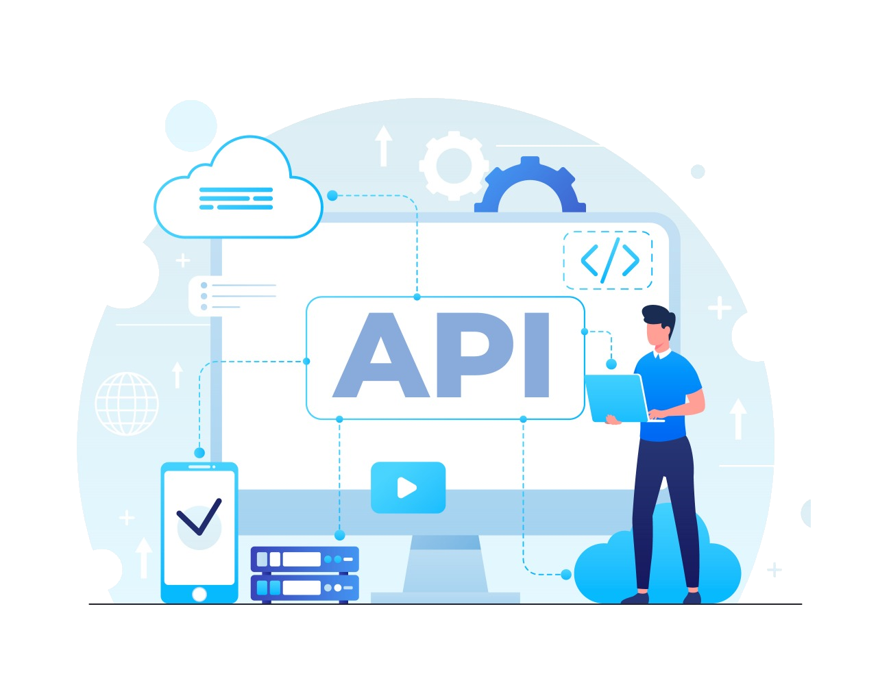

# Projeto API Laravel

O PROJECTO API-LARAVEL É UM PROJETO OPEN SOURCE QUE TEM COMO OBJETIVO A CRIAÇÃO E DE DIFERENTES TIPOS DE APIS, ESTABELECER CRITÉRIOS DE SEGURANÇA E PERSONIFICAÇÃO DE RESPOSTAS... 
